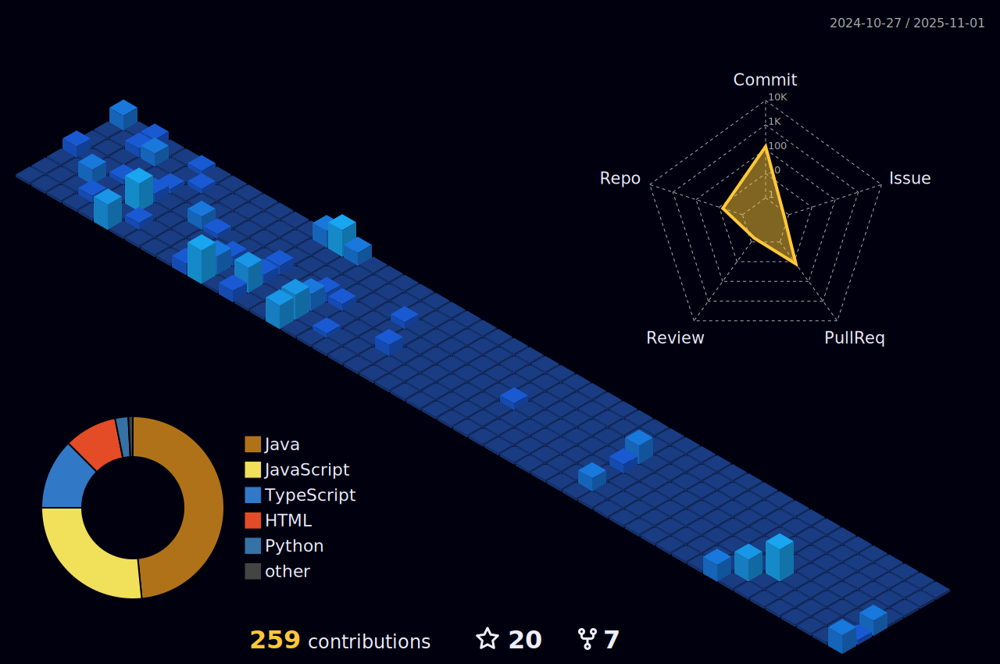

# 💫 About Me:
🔭 I’m currently working on Front-end Web Technologies 👯 I’m looking to collaborate on where I could Help 🤠I’m looking for help with Designs in websites 🌱 I’m currently learning React.js and C++ 💬 Ask me about Anything in CSS ⚡ Fun fact I am always ready to learn and use new tech

## 🌐 Socials:
  

# 💻 Tech Stack:
            
# 📊 GitHub Stats:
 
 

 
 

 
 

### ✍️ Random Dev Quote

---

<!-- Proudly created with GPRM ( https://gprm.itsvg.in ) -->
